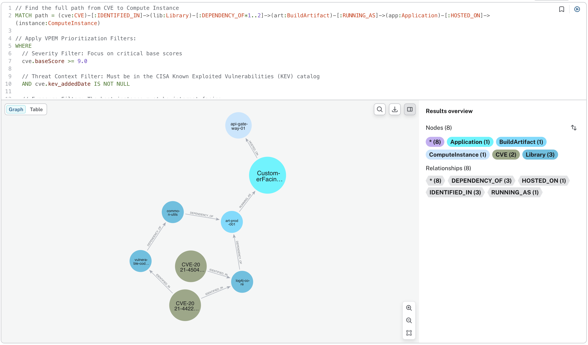
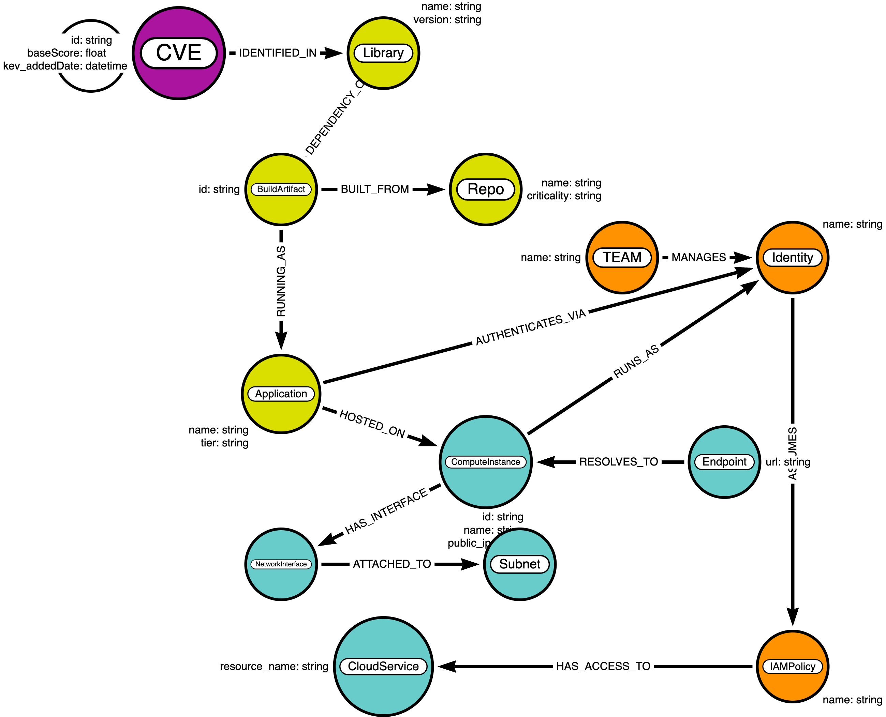

# VPEM Graph
### Vulnerability Prioritization and Exposure Management
**Cybersecurity Use Cases: Evolving from reactive patching to risk-based strategy**
*Based on: [pedroleitao-neo4j/cyber-vpem](https://github.com/pedroleitao-neo4j/cyber-vpem)*

---

# The Problem: Alert Fatigue
### Modern organizations are overwhelmed by thousands of software flaws.
- **The spreadsheet trap:** Treating a critical flaw on an isolated server the same as one on an internet-facing gateway.
- **Reactive vs Proactive:** Wasting resources on theoretical risks instead of real-world threats.
- **Lack of Context:** Severity scores (CVSS) don't account for your specific environment.

---

# What is VPEM?
### It shifts the focus from **"What is broken?"** to **"What could actually hurt us right now?"**

- **Exposure:** Is the system public-facing or internal?
- **Threat Intel:** Is there an active exploit in the wild (CISA KEV)?
- **Criticality:** Is this a test server or a production "Crown Jewel" database?

---

# Core Project Architecture
### The project is structured into three execution layers:

1. **[Data Ingestion](loader.ipynb):** Merging Asset, Vulnerability (NVD), and Threat (CISA KEV) data.
2. **[Specific Use Cases](vpem.ipynb):** Reachability, Impact, and Contextual Risk scoring.
3. **[Other Analysis](other.ipynb):** Advanced path traversal and security insights.

---

# Data Integration Layers
### To build a holistic view, three distinct data domains are integrated:

| Layer | Sources | Key Entities |
| :--- | :--- | :--- |
| **Organizational Context** | Cloud APIs, IAM, SBOMs | Apps, Compute, S3, IAM Policies |
| **Vulnerability Intel** | NVD | CVEs, CVSS Scores, Attack Vectors |
| **Threat Intelligence** | CISA KEV | Active Exploit Status, Deadlines |

---

# Visualizing Reachability
### Vulnerability to Compute Instance Reachability

- **Attack Path Analysis:** Identifying the direct path from a CVE to an internet-facing host.
- **Blast Radius:** Mapping what a compromised identity can access.

---

# The Resulting Schema
### The graph connects code, infrastructure, and identity in real-time.

*The extended schema captures deployment, usage, and vulnerability identification.*

---

# The Graph Advantage
### Why use Neo4j for Vulnerability Management?

- **Real-world Reachability:** Is the vulnerable library actually reachable from an `Endpoint`?
- **Impact Analysis:** If this server is compromised, which "Crown Jewel" assets (PII databases) are at risk via its Identity?
- **Efficiency:** Find the "Chokepoint"—the one library update that fixes the most reachable risk.

---

# Outward System Integration
### The VPEM graph acts as a **central nervous system** for security data:

- **SecOps (SOAR):** Contextual alert enrichment and automated containment.
- **DevOps (CI/CD):** "Policy as Code" guardrails to fail builds that create lateral movement paths.
- **GRC & Compliance:** Strategic risk metrics and CISA KEV remediation tracking.

---

# Questions?
**GitHub:** [pedroleitao-neo4j/cyber-vpem](https://github.com/pedroleitao-neo4j/cyber-vpem)